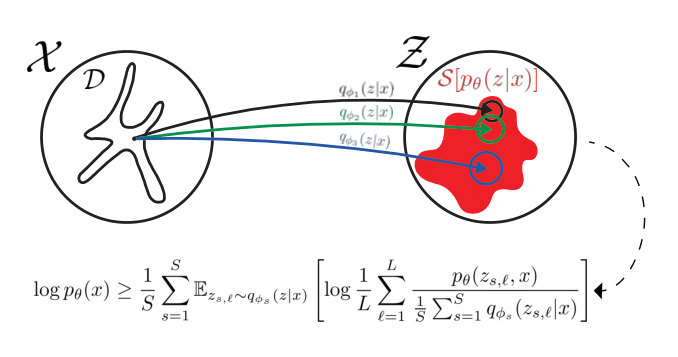

# The Official Repository of MISELBO - Multiple Importance Sampling ELBO and Deep Ensembles of Variational Approximations

<div align="center">
  <a>Oskar Kviman</a> &emsp; <b>&middot;</b> &emsp;
  <a>Harald Melin</a> &emsp; <b>&middot;</b> &emsp;
  <a>Hazal Koptagel</a> &emsp; <b>&middot;</b> &emsp;
  <a>Víctor Elvira</a> &emsp; <b>&middot;</b> &emsp;
  <a>Jens Lagergren</a> &emsp; &emsp;
</div>
<br>
<br>

[MISELBO](https://arxiv.org/abs/2202.10951) is a framework for evaluating an ensemble of variational distributions trained against a common target distribution. In this repository, we provide code and instructions on how to reproduce the results of the paper. 
More generally, this can e.g. be used as a template on how to train and evaluate deep generative ensembles of encoders for Variational Autoencoders, or to gain a multimodal variational distribution from a set of diverse unimodal variational distributions.

<p align="center">
    
</p>

## MISELBO for NVAE
To train an ensemble of variational approximations using the [NVAE](https://arxiv.org/abs/2007.03898)
model:
1. Clone the NVAE [repository](https://github.com/NVlabs/NVAE).
2. Clone this repository. 
3. Replace/add the files "train.py", "model.py" and "miselbo_eval.py" from this repository to the NVAE repo.
4. Follow the instructions for MNIST in the NVAE repository Readme to train p<sub>&theta;</sub> and q<sub>&Phi;<sub>1</sub></sub>.

To train additional q<sub>&Phi;<sub>i</sub></sub>:
``` 
train.py --train_new_q True --seed "seed != seed of q_1" "same arguments as when training q_1 and p" 
```
The train_new_q argument ensures that the decoder of p is not trained.

## Reproducing MISELBO-NVAE results using already trained p<sub>&theta;</sub>, q<sub>&Phi;<sub>1</sub></sub> and q<sub>&Phi;<sub>2</sub></sub>
The NVAE models trained for five different seeds, used in table 3 of [MISELBO](https://arxiv.org/), are too 
large to put in this repo. Therefore, one model is selected: p<sub>&theta;</sub>, q<sub>&Phi;<sub>1</sub></sub> trained 
with seed = 3 and q<sub>&Phi;<sub>2</sub></sub> trained with seed = 0. In order to run MISELBO for this ensemble follow
the steps below:
1. Follow steps 1-3 from the previous section.
2. Fetch the "trained_ensemble" branch of this repo ([git LFS](https://git-lfs.github.com/) is needed since the model files are 671MB in total).
3. Copy the "models" folder, including subfolders and files to the NVAE root folder.
4. Install MISELBO specific package: pandas.
5. In the NVAE root folder, run command:
``` 
python miselbo_eval.py 
```

## Reproducing other experiments
### 5.1.1 Ensembling Variational Approximations
To reproduce the results of Table 2 and plots in Figure 2 do:
1. Install pytorch 1.8.0, seaborn, matplotlib and scipy with dependencies.
2. Run the "vi_approx_experiment.py" file in the "Other experiments/5.1.1 Ensembling Variational Approximations"-folder

### 5.1.2 JSD as a Diversity Metric and Visualizing ∆L

### 5.3 Phylogenetic Tree Inference

